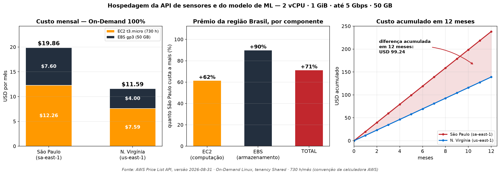
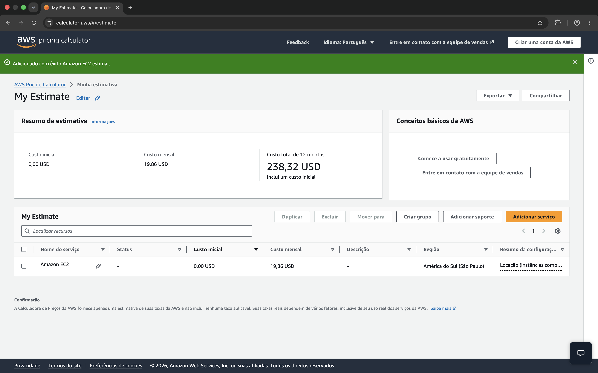
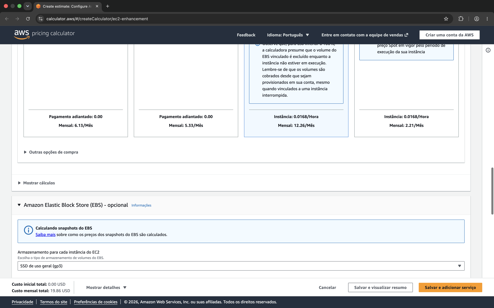
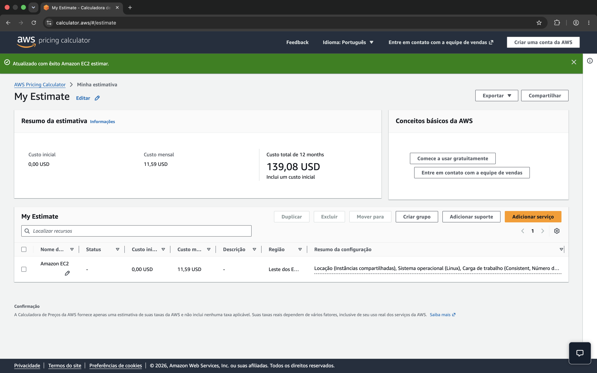

# 🌾 FarmTech Solutions — Fase 5: Machine Learning na Cabeça

**PBL de Inteligência Artificial — FIAP | Cap 01, Fase 5**

| Integrante | RM |
|---|---|
| Kainan Bilibio Aguiar | 570594 |
| Guilherme C. Ávila | 571294 |

---

## Sobre o projeto

A FarmTech Solutions é uma startup acadêmica fictícia que presta serviços de
Inteligência Artificial ao agronegócio. Nesta fase, o cliente é uma fazenda de
**200 hectares** — cerca de 210 campos de futebol oficiais — que cultiva quatro
culturas tropicais simultaneamente e coleta dados de solo e clima por sensores em
campo.

A pergunta de negócio é direta: **dadas as condições medidas, qual será o
rendimento da safra?**

Este repositório entrega duas frentes:

| Entrega | O que é | Onde está |
|---|---|---|
| **1 — Machine Learning** | Análise exploratória, clusterização, detecção de outliers e cinco modelos preditivos sobre a base `crop_yield.csv` | [Notebook Jupyter](#-entrega-1--machine-learning) |
| **2 — Computação em Nuvem** | Estimativa de custos na AWS para hospedar a API de sensores e o modelo, comparando São Paulo e Norte da Virgínia | [Seção neste README](#-entrega-2--computação-em-nuvem-aws) |

### Continuidade do projeto

Este é o quinto capítulo de um trabalho contínuo. As fases anteriores estão em
[**kainan-beep/fiap04cap1**](https://github.com/kainan-beep/fiap04cap1):

| Fase | Entrega |
|---|---|
| 2 | Sistema IoT com ESP32 — sensores de umidade do solo, pH via LDR, presença de fósforo e potássio, bomba de irrigação por relé |
| 3 | Banco relacional Oracle e dashboard de monitoramento em Streamlit |
| 4 | Machine Learning sobre os dados dos sensores, integrado ao dashboard |
| **5** | **Este repositório** |

---

## 📓 Entrega 1 — Machine Learning

### ➡️ [**Abrir o notebook: `KainanBilibioAguiar_rm570594_pbl_fase4.ipynb`**](KainanBilibioAguiar_rm570594_pbl_fase4.ipynb)

Todo o desenvolvimento, as análises, os achados e as conclusões estão no
notebook. Ele é o documento principal desta entrega e está organizado em quatro
blocos, com todas as células executadas e os resultados salvos:

| Bloco | Conteúdo |
|---|---|
| **1. Análise exploratória** | Estrutura e qualidade da base, padronização das variáveis, correção da unidade do alvo, distribuições e análise de correlação |
| **2. Clusterização e outliers** | K-Means com escolha de `k` justificada por cotovelo e silhueta, projeção PCA, e detecção de cenários discrepantes por três critérios independentes |
| **3. Modelagem preditiva** | Cinco algoritmos de regressão comparados sob validação cruzada agrupada, com análise de resíduos e importância de variáveis |
| **4. Conclusões** | Respostas às perguntas do projeto, pontos fortes, limitações e recomendações à fazenda |

> **Sobre o nome do arquivo.** O sufixo `pbl_fase4` segue literalmente o padrão
> de nomeação exigido no enunciado da Fase 5.

### A base de dados

`dados/crop_yield.csv` — 156 linhas, 6 colunas, sem valores ausentes.

| Variável | Descrição | Unidade |
|---|---|---|
| `Crop` | Cultura para a qual o rendimento é medido | — |
| `Precipitation` | Quantidade de chuva | mm/dia |
| `Specific Humidity at 2 Meters` | Vapor de água por quilograma de ar seco, a 2 m do solo | g/kg |
| `Relative Humidity at 2 Meters` | Vapor de água como % do máximo suportado | % |
| `Temperature at 2 Meters` | Temperatura a 2 m acima do solo | °C |
| `Yield` | **Variável alvo** — rendimento da safra | hg/ha |

As quatro culturas são cacau em amêndoas, fruto de dendê, arroz em casca e
borracha natural, com 39 observações cada.

> ⚠️ **A unidade do alvo diverge do enunciado.** O enunciado descreve o
> rendimento em toneladas por hectare, mas os valores da coluna vão de 5.249 a
> 203.399 — impossível em t/ha. O notebook documenta a investigação e a correção
> aplicada. Essa checagem mudou a interpretação de todas as métricas de erro do
> trabalho.

### Como executar

```bash
# 1. Criar o ambiente e instalar as dependências
python3 -m venv .venv
source .venv/bin/activate          # no Windows: .venv\Scripts\activate
pip install -r requirements.txt

# 2. Abrir o notebook a partir da raiz do repositório
jupyter notebook KainanBilibioAguiar_rm570594_pbl_fase4.ipynb
```

O notebook lê o CSV por caminho relativo (`dados/crop_yield.csv`), então precisa
ser executado a partir da raiz do repositório. Todas as células já vêm executadas
— basta abrir para ver os resultados.

### 🎥 Vídeo demonstrativo — Entrega 1

_(link a preencher)_

---

## ☁️ Entrega 2 — Computação em Nuvem (AWS)

O modelo desenvolvido na Entrega 1 precisa sair do notebook e ir para produção.
A arquitetura pretendida é uma **API que recebe os dados dos sensores instalados
em campo** — os mesmos do ESP32 da Fase 2 — armazena as leituras e executa a
inferência do modelo de Machine Learning.

Esta seção compara o custo de hospedar essa API em duas regiões da AWS e
justifica a escolha.

### Configuração dimensionada

| Requisito | Especificação | Instância que atende |
|---|---|---|
| Processamento | 2 vCPU | `t3.micro` |
| Memória | 1 GiB | `t3.micro` |
| Rede | até 5 Gigabit | `t3.micro` — *Up to 5 Gigabit* |
| Armazenamento | 50 GB | EBS `gp3` |
| Modelo de compra | **On-Demand, 100% de utilização** | — |
| Sistema operacional | Linux | — |

O `t3.micro` é a menor instância que atende simultaneamente aos quatro
requisitos. O `t2.micro`, mais barato, oferece apenas 1 vCPU e por isso foi
descartado.

### Comparação de custos



| Componente | São Paulo (`sa-east-1`) | N. Virgínia (`us-east-1`) | Diferença |
|---|---|---|---|
| EC2 `t3.micro` — preço/hora | USD 0,0168 | USD 0,0104 | +62% |
| EC2 — 730 h/mês | USD 12,26 | USD 7,59 | +USD 4,67 |
| EBS `gp3` — preço/GB-mês | USD 0,152 | USD 0,080 | +90% |
| EBS — 50 GB | USD 7,60 | USD 4,00 | +USD 3,60 |
| **TOTAL MENSAL** | **USD 19,86** | **USD 11,59** | **+71,4%** |
| **TOTAL ANUAL** | USD 238,32 | USD 139,08 | +USD 99,24 |

**A opção mais barata é a Norte da Virgínia**, com USD 11,59/mês contra USD 19,86
em São Paulo — uma economia de USD 8,27 por mês, ou USD 99,24 ao ano.

Um detalhe da decomposição merece atenção: o prêmio da região Brasil não está
concentrado na computação. O EC2 custa 62% mais caro, mas o **armazenamento custa
90% mais caro**. Como a aplicação é de telemetria — muitos registros pequenos
acumulados ao longo do tempo — o peso do armazenamento tende a crescer, e com ele
a diferença entre as regiões.

> **Fonte dos valores.** Preços On-Demand para Linux, tenancy compartilhada
> (*Instâncias compartilhadas*), carga de trabalho *Uso constante* — equivalente
> a 100% de utilização. Valores obtidos na calculadora da AWS e conferidos
> contra a *AWS Price List API* (versão de 31/08/2026).
>
> O período mensal de **730 horas** é a convenção adotada pela própria
> calculadora (365 × 24 ÷ 12). O total anual segue a mesma convenção da AWS, que
> arredonda o custo mensal para duas casas antes de projetar os 12 meses —
> por isso 19,86 × 12 = 238,32, e não 238,37.

### Prints da calculadora

**São Paulo (`sa-east-1`) — resumo da estimativa**



**São Paulo (`sa-east-1`) — configuração detalhada**



**Norte da Virgínia (`us-east-1`) — resumo da estimativa**



### Justificativa da escolha: São Paulo, apesar de 71% mais cara

A pergunta do enunciado acrescenta duas restrições ao problema: **é preciso
acessar rapidamente os dados dos sensores** e **há restrições legais para
armazenamento no exterior**. Sob essas condições, a resposta mais barata deixa de
ser a resposta correta.

**1. Restrição legal — LGPD e soberania de dados.**

A Lei Geral de Proteção de Dados (Lei 13.709/2018) não proíbe a transferência
internacional de dados, mas a condiciona: o artigo 33 exige que o país de destino
ofereça grau de proteção adequado, ou que existam garantias contratuais
específicas — cláusulas-padrão, normas corporativas globais ou consentimento
específico e destacado do titular. Hospedar em `us-east-1` transformaria cada
leitura de sensor em uma transferência internacional, obrigando a fazenda a
manter esse aparato jurídico e a comprová-lo perante a ANPD.

O enunciado, além disso, é explícito ao afirmar que **há restrição legal para
armazenamento no exterior**. Diante de uma restrição declarada, a análise de
custo é subordinada: não se escolhe a opção mais barata que viola a exigência.
Manter os dados em `sa-east-1` elimina a questão na origem — o dado nasce, é
processado e permanece em território nacional.

Há ainda um agravante de contexto. Dados agrícolas de produtividade são
**informação estratégica e comercialmente sensível**: revelam capacidade
produtiva, decisões de manejo e posição competitiva da fazenda. Mantê-los sob
jurisdição brasileira reduz a exposição a ordens de acesso emitidas por
autoridades estrangeiras.

**2. Acesso rápido — latência.**

A latência de rede entre o Brasil e a Virgínia do Norte é da ordem de **120 a 150
ms** por ida e volta, contra **5 a 30 ms** para São Paulo a partir do território
nacional. A diferença vem da distância física — cerca de 7.600 km — e é limitada
pela velocidade da luz na fibra: nenhuma otimização de software a elimina.

Para esta aplicação, isso pesa em três frentes:

- **Ingestão dos sensores.** Cada leitura enviada pelo ESP32 exige o
  estabelecimento da conexão e a confirmação do recebimento. Com dezenas de
  sensores reportando em intervalos curtos, a latência multiplica o tempo total
  de ingestão e aumenta a chance de *timeout* em conexões rurais, que já são
  instáveis.
- **Resposta da inferência.** A previsão de rendimento perde utilidade
  operacional se demorar a chegar. Numa decisão de irrigação tomada em campo, a
  diferença entre 30 ms e 150 ms é a diferença entre uma resposta imediata e uma
  perceptivelmente lenta.
- **Reação a evento crítico.** O cenário que mais importa é o de alerta: umidade
  do solo abaixo do limite, acionamento de bomba. Latência acumulada nesse
  caminho atrasa a resposta a um evento que já é urgente.

**3. O custo em perspectiva.**

Os 71% de diferença percentual soam expressivos até serem traduzidos em valor
absoluto: **USD 8,27 por mês**, ou cerca de R$ 45. Para uma operação agrícola de
200 hectares, isso é irrelevante frente ao custo de um único insumo — e
incomparavelmente menor que o risco de uma sanção da ANPD, que pode chegar a 2%
do faturamento, limitada a R$ 50 milhões por infração.

A economia anual de USD 99,24 não compensa assumir risco jurídico e degradar o
tempo de resposta do sistema.

**Conclusão.** A Norte da Virgínia é a opção mais barata em termos absolutos e
seria defensável para uma carga de trabalho sem dado pessoal e sem exigência de
baixa latência — processamento em lote, treinamento de modelo, arquivamento. Não
é este o caso. Para hospedar a API que recebe dados de sensores em território
brasileiro e responde a decisões operacionais em campo, a escolha é
**São Paulo (`sa-east-1`)**.

> **Recomendação complementar.** Uma vez validada a operação, migrar de On-Demand
> para *Savings Plan* de 1 ano reduziria o custo da instância sem alterar a
> região — atacando o custo pelo eixo correto, que é o modelo de compra, e não a
> localização do dado.

### 🎥 Vídeo demonstrativo — Entrega 2

_(link a preencher)_

---

## Estrutura do repositório

```
fiap05cap1/
├── README.md                                     Este arquivo
├── requirements.txt                              Dependências Python
├── KainanBilibioAguiar_rm570594_pbl_fase4.ipynb  Notebook da Entrega 1
├── dados/
│   └── crop_yield.csv                            Base fornecida pela FIAP
└── assets/
    ├── aws/                                      Prints da calculadora (Entrega 2)
    └── graficos/                                 Gráficos de apoio
```

## Tecnologias

`Python 3.13` · `pandas` · `NumPy` · `scikit-learn` · `Matplotlib` · `seaborn` · `Jupyter`

## Referências

- FAOSTAT — Food and Agriculture Organization, base de dados de produção agrícola
- Scikit-Learn — documentação oficial
- EMBRAPA — Agricultura Digital
